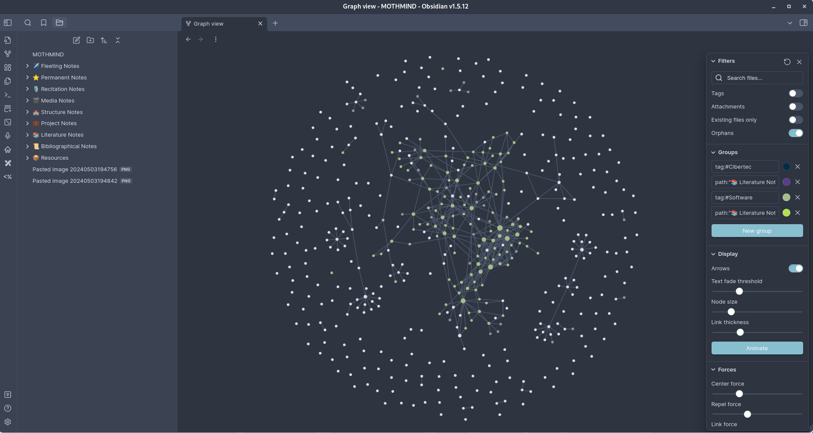
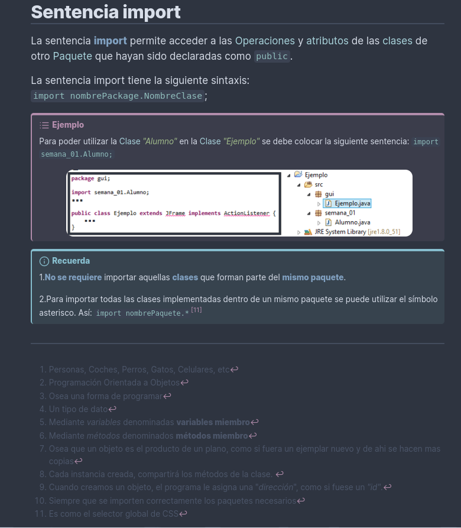
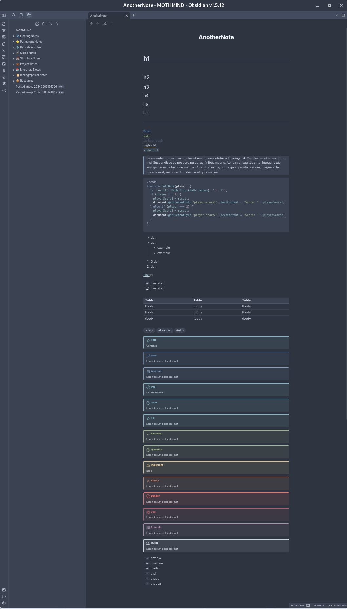
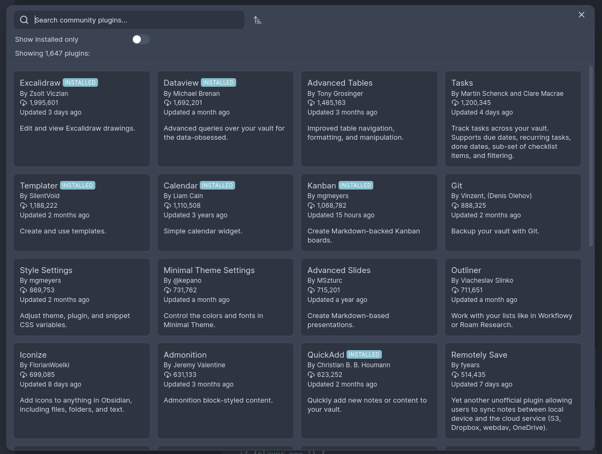
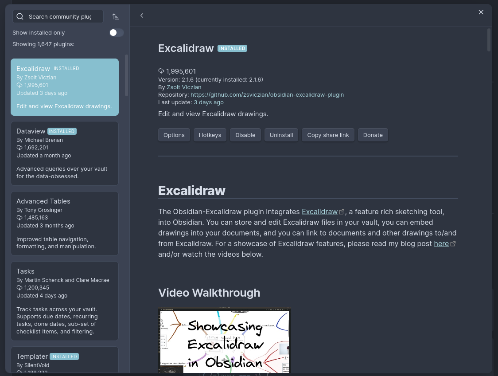
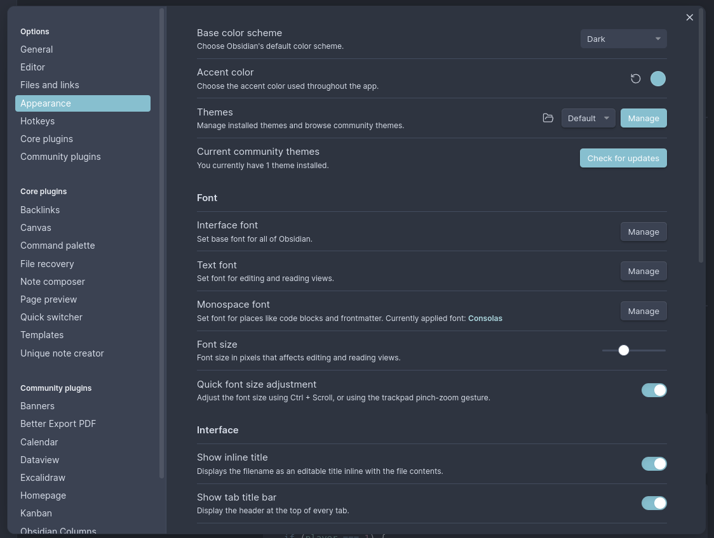

# The-Nordic-Obsidian-Theme
A custom theme based on [Nord Theme](https://www.nordtheme.com/)
This theme is a CSS snippet for Obsidian, which is usually found in the root of your vault,`/.obsidian/snippets.` Otherwise, you can create the folder and add the `TNOT.css` file there. This snippet is a modification of the **PLN theme**, all credits go to them.

